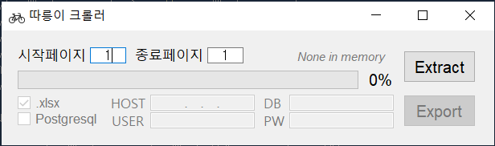
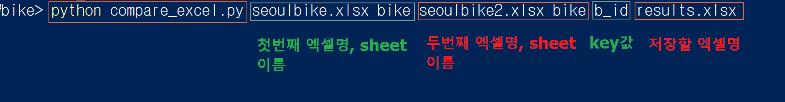

## bike_crawler
따릉이 대여소 정보 크롤러, 따릉이 대여소 현황

### 하기 링크의 서울시 따릉이 정보를 크롤링하여 csv, 엑셀으로 저장.

https://www.bikeseoul.com/app/station/moveStationSearchView.do?currentPageNo=1

### [ CLI version ] : 
~~~
# 1페이지 ~ 특정 페이지 내용을 CSV로 저장.
python bike_crawler.py
~~~

### [ GUI version ] : 
~~~
# 시작 페이지 ~ 종료페이지 내용을 xlsx로 저장 or postgresql DB에 "Bike" 테이블로 저장.
python bike_crawler_ui.py
~~~

### [ 따릉이 bike excel 2개 차이확인 ]
~~~
# 두개의 따릉이엑셀 파일을 입력시 key를 기준으로 변화가 있다면, idx필드를 업데이트 해준다.
python compare_execl.py 1st_excelfile_name, 1st_excelsheet_name, 2nd_excelfile_name, 1st_excelsheet_name, key_value, output_excelfile_name

## <idx 설명>
##   new : 새로생긴 row
##   del : 삭제된 row
##   U : 명칭변경
##   X : X좌표변경
##   Y : Y좌표변경
~~~

